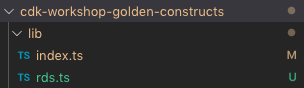

author: Alvaro Mongil
summary: Sharing and deploying cloud infrastructure using the AWS CDK
status: draft
id: aws-cdk-workshop
categories: aws,cdk,typescript,iac
environments: ts
feedback link: https://github.com/amongil/aws-cdk-workshop-cl/issues

# Deploying cloud infrastructure using the AWS CDK

## Introduction
Duration: 5

When defining Infrastructure as Code (IaC) in AWS, writing YAML CloudFormation templates is probably the most common choice among Enterprises. Main reason being that CloudFormation is a first-class service in the AWS ecosystem. It is completely integrated with all the other services in the platform and keeps getting updates and improvements over time.

But YAML is not a programming language and the usual method of collaboration and sharing of templates is copy-pasting existing templates and adapting those to fit your current needs. This makes the process of describing the infrastructure for a new project or even updating an existing one tedious and very prone to human error. There has not existed an official tool for describing and deploying CloudFormation stacks and AWS resources programmatically, and the community has turned to third-party tools like [troposphere](https://github.com/cloudtools/troposphere) in order to get benefits from a high level language like Python, but it does come with its own issues, like being behind on CloudFormation-supported services, updates, and some inconsistency in parameter naming.

That was the situation until now, that AWS releases its [CDK](https://aws.amazon.com/cdk/), or Cloud Development Kit.

> AWS CDK gives you the expressive power of programming languages for defining infrastructure. Familiar features such as objects, loops, and conditions accelerate your development process. You can also use AWS CDK with your integrated development environment (IDE) to take advantage of existing productivity tools and testing frameworks.

As of August 2019, languages supported are TypeScript, Python, Java (developer preview), and .NET (developer preview).

Positive
: This workshop will be based off the TypeScript libraries.

This workshop aims to showcase some of the features that makes the CDK unique (such as *constructs* and *aspects*) and to prove how they can solve some common challenges, such as corporate compliance, collaboration in development, reusability of templates, testing, and automated CI/CD processes.

## Prerequisites
Duration: 5
- [AWS CLI](https://docs.aws.amazon.com/cli/latest/userguide/cli-chap-install.html)
- AWS Account and User with appropiate rights
- [Node.js (>= 8.12.0)](https://nodejs.org)
- [AWS CDK Toolkit](https://github.com/aws/aws-cdk)

## CDK concepts
### Constructs
> Constructs are the basic building blocks of AWS CDK apps. A construct represents a "cloud component" and encapsulates everything AWS CloudFormation needs to create the component. A construct can represent a single resource, such as an Amazon Simple Storage Service (Amazon S3) bucket, or it can represent a higher-level component consisting of multiple AWS CDK resources. [1]

The CDK comes included with a *Constructs library*, which provides low-level CloudFormation resources and also high-level Constructs based off these but which include certain fixed functionalities (e.g. a default-encrypted S3 bucket or a lifecycle policy applied to it).

**Construct classes extend other Constructs.**

[1]: https://docs.aws.amazon.com/cdk/latest/guide/constructs.html

### Aspects

>  Aspects are the way to apply an operation to all constructs in a given scope. The functionality could modify the constructs, such as by adding tags, or it could be verifying something about the state of the constructs, such as ensuring that all buckets are encrypted. [2]

**Construct classes implement Aspects.**

[2]: https://docs.aws.amazon.com/cdk/latest/guide/aspects.html

Duration: 5

## Importing and deploying existing CDK Constructs

We are going to use the CDK CLI to create our first CDK application. It will consist of an S3 bucket Construct provided by the Construct Library.

```shell
mkdir my-first-cdk-app && cd my-first-cdk-app
cdk init --language typescript
```

> Check the files created under the *bin* and *lib* folders. They hold the App and the Stack resources.

Next, let's check our tools are working properly by building and synthetising our code to a CloudFormation template.

```shell
npm run-script build
cdk synth
```

You should see an empty stack with just metadata information.

Let's now add our resource, an S3 bucket.

First, we need to install the S3 library using npm...

```shell
npm install @aws-cdk/aws-s3
```

Add the following snippet to the Stack file under the lib folder, which will contain our resources.

```typescript
// The code that defines your stack goes here
const bucket = new s3.Bucket(this, 'MyBucket');
```

Positive
: Don't forget to import the S3 library!

Let's take a look at the CloudFormation template again:

```shell
npm run-script build
cdk synth
```

You should see the S3 bucket resource added to your CloudFormation template.

We have mentioned before how we can have higher-order constructs which mask the underlying CloudFormation resources (like the S3 bucket resource we have just created) or how we could access directly the low-level CloudFormation resources. Let's see the diferences for ourselves and add a CfnBucket low-level resource to our stack. Add the following lines to your stack file:

```typescript
const cfnBucket = new s3.CfnBucket(this, 'MyCfnBucket');
```

If we build and *synth* again we can see how the two buckets have different properties, the Construct Library higher-order S3 construct has set up some policy attributes for us, even though we have created both the high-order and low-level construct resources without any properties. **Masking and abstracting properties and functionalities from the consumer is one of the strengths of the CDK**.

Let's deploy our Stack now!

```shell
cdk deploy
```

Easy as that.

Duration: 15

## Authoring CDK Constructs

Positive
: We are going to write an NPM library that is going to be imported by our client application. For that, we are going to host our code in Github instead of publishing it on the NPM registry. We are going to omit git-related commands on this tutorial.

Now that we've learned about high-order and low-order constructs and how to consume them in our stacks, It's time to create our first Construct and publish it as a NPM library which can then be consumed by a client application.

### Creating our Construct class

The same way we did back when creating our first app, we can use the CDK CLI to create our library, but we have to specify that we want to create a library now:

```shell
mkdir cdk-workshop-golden-constructs && cd cdk-workshop-golden-constructs
cdk init lib --language=typescript
```

Positive
: See how we no longer have an app class and how the class that extends the Construct is exported

The context for our example is going to be the following: a central Cloud Architecture team is going to provide golden resources to the rest of the organization. These resources are going to adhere to a set of compliance policies that are going to be enforced on the resources through implemented Aspects.

To examplarize, we are going to build a Construct for a Production PostgreSQL RDS instance that adheres to the following compliance requirements:
- MultiAZ enabled
- Storage encrypted with default or with provided KMS key (clients consuming this construct will have the freedom to choose which)
- Must be tagged with the *Department* key

We're going to slightly change the structure that the CLI creates for us. We are going to have a TypeScript file for each class that we are going to export (one .ts file for RDS in our case) and then an index.ts that will export the classes on those files.

So the structure of our lib folder will be the following:



Contents of index.ts:

```typescript
export * from './rds';
```

Contents of rds.ts:
```typescript
import cdk = require('@aws-cdk/core');
import rds = require('@aws-cdk/aws-rds');


export interface ProductionPostgresqlProps {}

export class ProductionPostgresql extends cdk.Construct {
  public readonly productionPostgresql: rds.CfnDBInstance;

  constructor(scope: cdk.Construct, id: string, props: ProductionPostgresqlProps) {
    super(scope, id);
  }
}
```

Positive
: Don't forget to install and save the dependency for aws-rds with ```shell npm install --save @aws-cdk/aws-rds```

So let's go ahead and build first the RDS resource for the PostgreSQL instance and then implement the mentioned Aspects on a later stage. We will make use of the [reference documentation](https://docs.aws.amazon.com/cdk/api/latest/docs/aws-rds-readme.html) and, since we are going to be creating raw low-level CloudFormation resources, the [CloudFormation reference](https://docs.aws.amazon.com/es_es/AWSCloudFormation/latest/UserGuide/aws-properties-rds-database-instance.html) too.

```typescript
import cdk = require('@aws-cdk/core');
import rds = require('@aws-cdk/aws-rds');


export interface ProductionPostgresqlProps {}

export class ProductionPostgresql extends cdk.Construct {
  public readonly productionPostgresql: rds.CfnDBInstance;

  constructor(scope: cdk.Construct, id: string, props: ProductionPostgresqlProps) {
    super(scope, id);

    this.productionPostgresql = new rds.CfnDBInstance(this, 'productionPostgresql', props);
  }
}
```
This is going to be our constructor to create a low-level CloudFormation general-purpose RDS Instance. Next, we will apply a database engine to the Construct and some compliance constraints too.

### Implementing Aspects


### Consuming our Construct class
### Writing tests for our CDK Application

Duration: 5

## CDK Applications CI/CD with CodePipeline
Duration: 5
